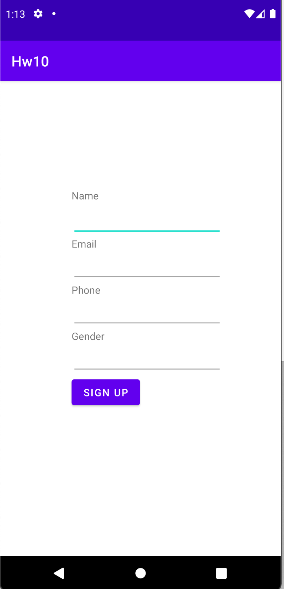

# HW_Week03_Day01_WorkingWithIntents
The Home Work has to be delievered before 9AM ⚠️
# What you'll build 📋
---
## Part I
### Create a new android application which contains two activities:

First Activity:
- Will take 2 numbers and get the sum of these numbers and pass the result to the second activity.

Second Activity:
- Will display the result

---
## Part II
### Create a new android application which contains two activities: 

First Activity:
- Will contains login form
- Email Validation 
- Phone Validation
- Create model to hold the information
- Pass the model object to the second activity 

Second Activity:
- Will contains user information

# Learning Resources  📚
* [Explicit Intent](https://www.javatpoint.com/kotlin-android-explicit-intent)
* [Implicit Intent](https://www.javatpoint.com/kotlin-android-implicit-intent)

